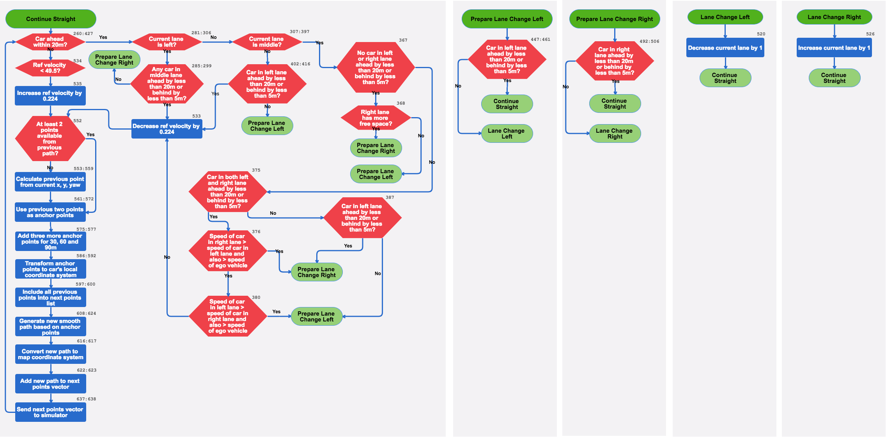

# CarND-Path-Planning-Project
Self-Driving Car Engineer Nanodegree Program
   
### Summary
My implementation is based on the walkthrough given by Aaron Brown and David Silver. I use anchor points at 30, 60 and 90 meters to calculate smooth trajectory using spline function and merge that with remaining points from previous path. I reduce the ego vehicle velocity if there is another car within 20 meters in current lane.
I implemented a finite state machine for behavior planning. If there is another vehicle in front of ego vehicle within 20 meters then the FSM changes lane if safe to do so.

### Finite State Machine
The FSM contains 5 states **Continue Straight**, **Prepare Lane Change Left**, **Prepare Lane Change Right**, **Lane Change Left** and **Lane Change Right**. The diagram below shows the state machine and is self explanatory. For each of the block in the digram, I have mentioned the corresponding line numbers in ``main.cpp`` that implement the given logic.

### Simulation
Here's the video that shows the car driving for about 5 minutes.
